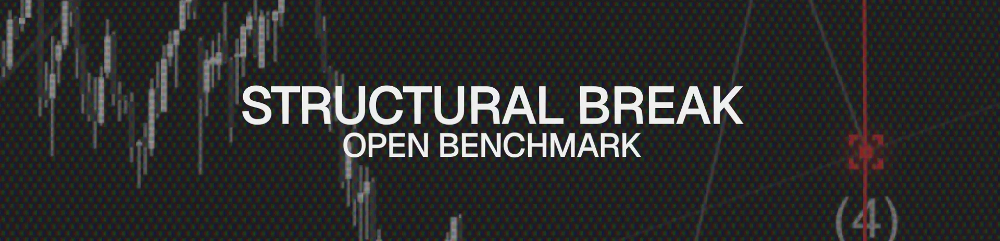

# ADIA Lab Structural Break Detection


Competition solution for the ADIA Lab Structural Break Challenge on CrunchDAO.

**Current Best Performance**: 0.8966 AUC (5-fold CV)

**Currently in 11th place as of February 13, 2026 - https://hub.crunchdao.com/competitions/structural-break-open-benchmark/leaderboard**

## Overview

This project detects structural breaks in time series data using advanced statistical tests and machine learning. The solution combines multiple feature engineering approaches with a diverse LightGBM ensemble.

## Quick Start

### Installation

```bash
# Clone the repository
git clone <your-repo-url>
cd adia_structural_break

# Create virtual environment
python -m venv .venv
.venv\Scripts\activate  # On Unix: source .venv/bin/activate

# Install dependencies
pip install -r requirements.txt
```

### Training

```bash
# Train the best model (advanced statistical tests)
python experiments/train_advanced_tests.py

# Expected output: ~0.8966 AUC
```

### Inference

```bash
# Generate predictions for test set
python solution.py
```

## Project Structure

```
adia_structural_break/
├── src/
│   └── sb/
│       ├── features/          # Feature engineering modules
│       │   ├── base.py        # Base CV features (920 features)
│       │   ├── statistical_tests.py  # Statistical tests (25 features)
│       │   ├── advanced_tests.py     # Advanced tests (21 features) ⭐
│       │   ├── autoencoder.py        # PyTorch autoencoder
│       │   ├── changepoint_features.py  # Bayesian change points
│       │   └── wavelet_features.py    # Wavelet decomposition
│       ├── data_loader.py     # Data loading utilities
│       └── cv_proper.py       # Cross-validation framework
├── experiments/               # Training experiments
│   ├── train_advanced_tests.py  # Best model (0.8966 AUC) ⭐
│   ├── train_with_wavelets.py
│   ├── train_with_autoencoder_v2.py
│   └── train_with_changepoints.py
├── tests/                     # Unit tests
├── scripts/                   # Utility scripts
├── notebooks/                 # Jupyter notebooks
├── docs/                      # Documentation
├── data/                      # Data files (not in repo)
└── README.md
```

## Features

### Base Features (920 features)
- Multi-scale coefficient of variation (CV) at different window sizes
- Statistical transformations (log, sqrt, box-cox)
- Compression ratios (gzip, bz2)
- CUSUM-based change detection
- Boundary distance features
- Tail shape features

### Statistical Tests (25 features)
- Anderson-Darling test
- Cohen's d effect size
- Variance ratios
- IQR ratios
- Hypothesis tests (t-test, Mann-Whitney)
- Rolling statistics

### Advanced Statistical Tests (21 features) ⭐ **Best Performing**
- **Cramér-von Mises**: More powerful than Kolmogorov-Smirnov
- **Energy distance**: Distance-based distribution comparison
- **Wilcoxon rank-sum**: Robust non-parametric test
- **Mood's test**: Scale/variance differences
- **Tail features**: Quantile ratios, kurtosis, extremes
- **Spectral features**: FFT frequency domain analysis
- **Permutation entropy**: Time series complexity

**Key breakthrough**: 8 advanced features made top 100, `energy_cumsum` ranked #7 overall

## Model Architecture

**Ensemble**: 5 diverse LightGBM models
- Model 1: Baseline (depth=5, lr=0.05)
- Model 2: Deep + Regularized (depth=8, lr=0.03, reg_alpha=0.1, reg_lambda=0.1)
- Model 3: Shallow (depth=3, lr=0.05)
- Model 4: High sampling (depth=5, subsample=0.8, colsample=0.8)
- Model 5: Low learning rate (depth=5, lr=0.02, n_estimators=400)

**Feature selection**: Top 100 features via mutual information

**Calibration**: Tested both calibrated and uncalibrated - uncalibrated performs best (0.8966 vs 0.8949)

## Experiments Summary

| Approach | AUC | Change | Top 100 Features |
|----------|-----|--------|------------------|
| **Advanced Tests** | **0.8966** | **baseline** | **8 features** ✅ |
| Diverse Ensemble | 0.8866 | -0.0100 | - |
| Stacking | 0.8829 | -0.0137 | - |
| Wavelets | 0.8950 | -0.0016 | 0 features |
| Autoencoder | 0.8682 | -0.0284 | 1 feature |
| Change Points | 0.8651 | -0.0315 | 1 feature |

## Key Insights

1. **Simple statistical tests win**: Advanced statistical tests (Cramér-von Mises, energy distance, Mood's test) outperformed sophisticated deep learning approaches

2. **Feature selection is critical**: 100 features optimal (tested 33-150 range)

3. **Diverse LightGBM > Multi-algorithm**: 5 diverse LightGBM models beat stacking with XGBoost/CatBoost

4. **Uncalibrated > Calibrated**: Isotonic calibration slightly hurts performance

5. **PyTorch/Wavelets don't help**: Existing statistical features already capture the patterns

## Documentation

See the `docs/` folder for detailed documentation:
- `WINNING_SOLUTIONS_ANALYSIS.md` - Analysis of top competition solutions
- `ARCHITECTURE.md` - System architecture
- `GBM_GUIDE.md` - Gradient boosting guide
- `RESEARCH_GUIDE.md` - Research notes

## Competition Details

- **Platform**: CrunchDAO
- **Challenge**: ADIA Lab Structural Break Detection
- **Training Data**: 10,001 time series, 29.09% break rate
- **Task**: Binary classification (structural break present or not)
- **Metric**: ROC AUC
- **Deadline**: March 2026

## Performance Timeline

1. **Initial**: 0.70 AUC (basic features)
2. **Phase 1**: 0.87 AUC (CV features, transforms, CUSUM)
3. **Stacking**: 0.8829 AUC (multi-algorithm)
4. **Diverse Ensemble**: 0.8866 AUC (5 LightGBM models)
5. **Advanced Tests**: 0.8966 AUC ⭐ **(Current Best)**

## Requirements

```txt
numpy>=1.21.0
pandas>=1.3.0
scikit-learn>=1.0.0
lightgbm>=3.3.0
scipy>=1.7.0
torch>=2.0.0  # CPU version
ruptures>=1.1.0
pywt>=1.1.0
pyarrow>=8.0.0
```

## License

MIT

## Acknowledgments

- ADIA Lab for organizing the competition
- CrunchDAO platform
- Winning solutions from previous year's competition for inspiration
